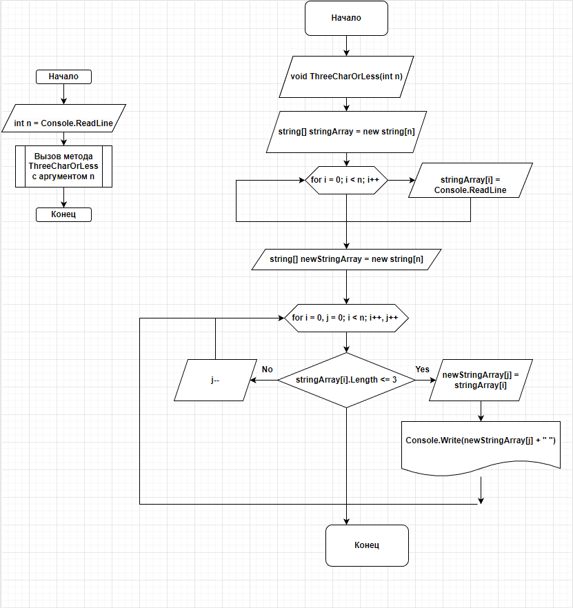

## Прочитай меня

* Создаем void метод ThreeCharOrLess с целочисленным аргументом n.
* Инициализируем строчный массив stringArray размером n.
* Создаем цикл for и вводим значение каждого элемента поочередно.
* Инициализируем еще один строчный массив newStringArray размером n.
* Создаем цикл for с двумя счетчиками i и j
* Задаем условие.
* Если выполняется, то newStringArray[j] = stringArray[i].
* Если не выполняется, отнимаем от счетчика j единицу, чтобы вместо элемента который не подошел по условию не записать пустое значение, а остаться на том же месте ждать удовлетворяющий условиям элемент. Конец метода
* Далее задаем целочисленное число n
* Вызываем метод ThreeCharOrLess(int n) с целочисленным аргументом n.